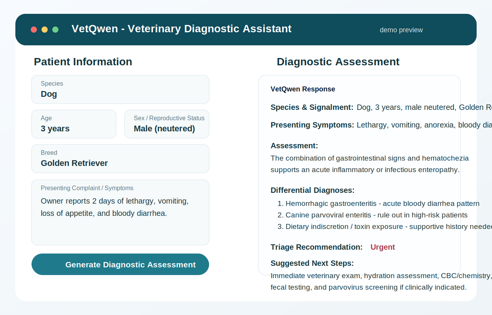
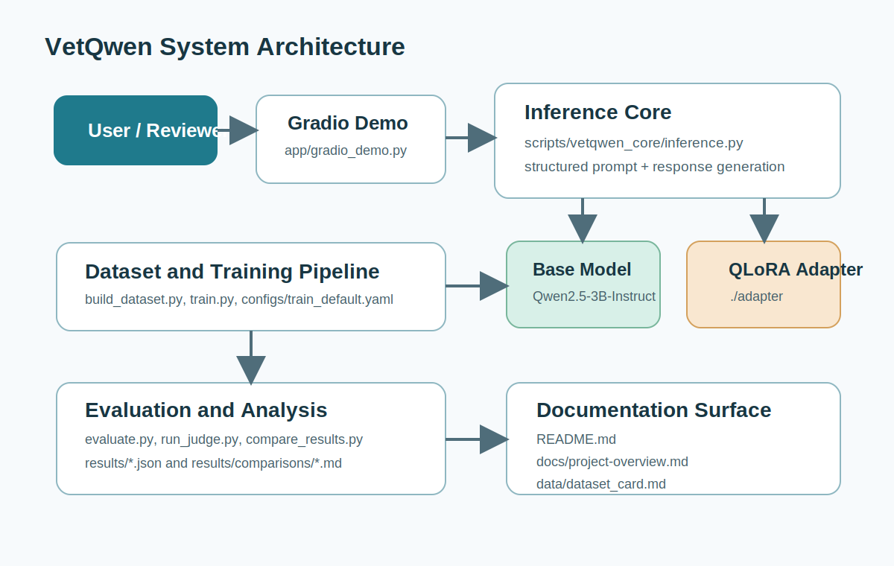
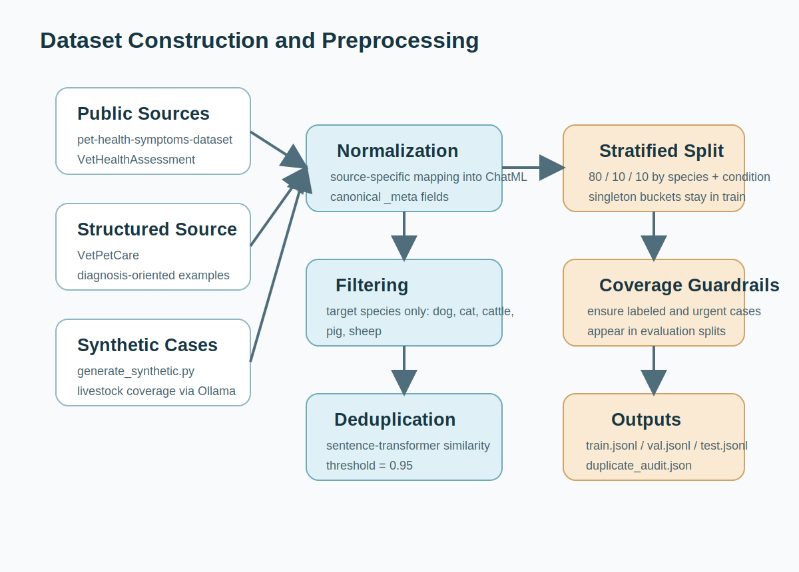
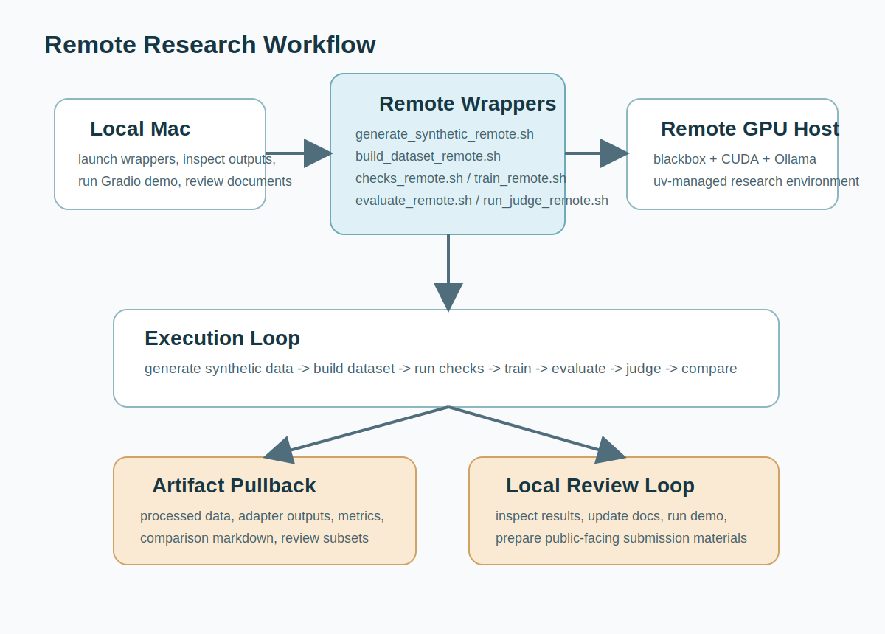
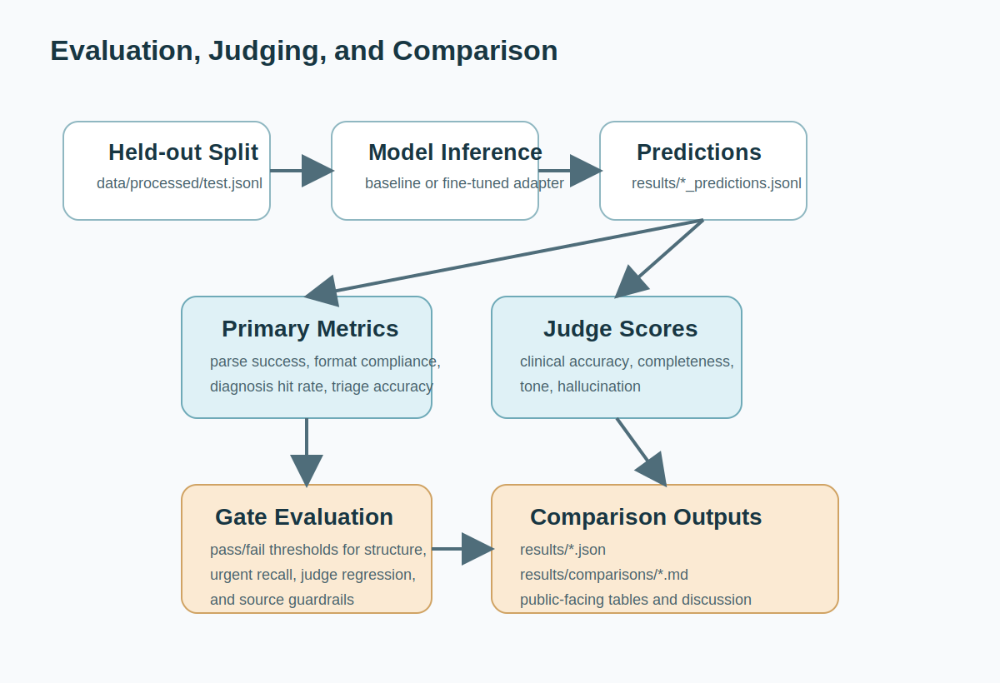
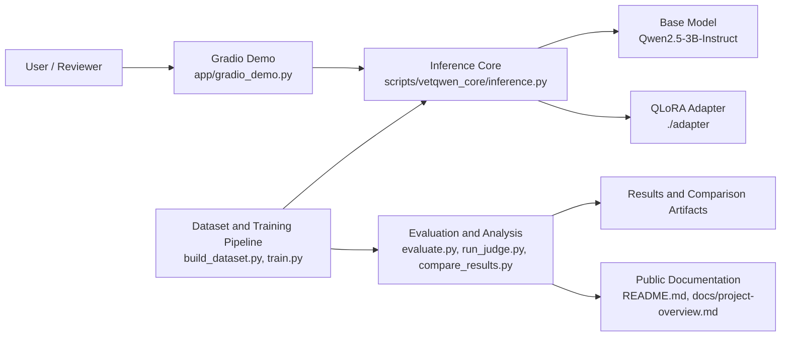
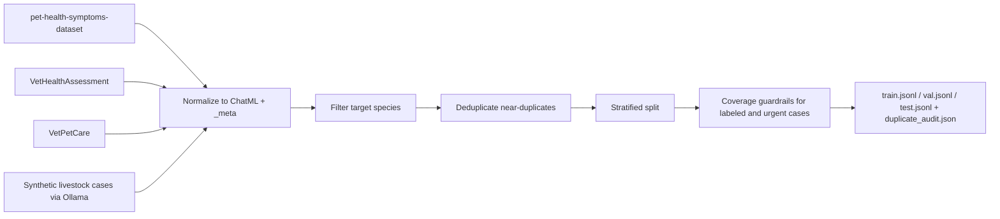
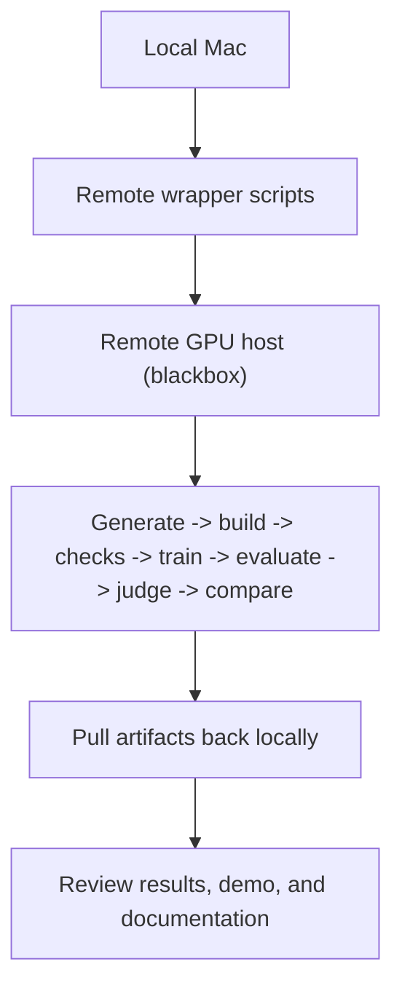
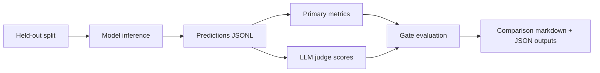

<div align="center">

# VetQwen

## Structured Veterinary Differential Diagnosis with QLoRA

**Author:** Ognjen Jovanovic  
**Date:** April 21, 2026  
**Repository:** [github.com/h01t/VetQwen](https://github.com/h01t/VetQwen)

**Academic note:** This document presents VetQwen as a research prototype prepared as part of a master's application and project submission package. It is intended to demonstrate technical depth, reproducibility, and honest evaluation rather than claim clinical readiness.

</div>

---

## Abstract

VetQwen is a domain-adapted large language model project for structured veterinary differential diagnosis. The system fine-tunes `Qwen/Qwen2.5-3B-Instruct` with QLoRA and targets a constrained output format covering signalment, presenting symptoms, assessment, ranked differentials, triage, and suggested next steps. The project combines public veterinary-adjacent datasets, livestock-oriented synthetic data generation, a remote-first research workflow, a local Gradio demo, and automated comparison artifacts for baseline-versus-fine-tuned evaluation.

The main contribution of the repository is not a claim of clinical deployment readiness, but a clean end-to-end research pipeline: dataset construction, model adaptation, demo delivery, metric reporting, and public-facing documentation. The current results show a major improvement in structure adherence and task-specific outputs after fine-tuning, while also revealing important limitations in judge-scored clinical quality that should remain visible in any academic or public presentation of the work.

## Problem Statement and Motivation

Veterinary decision support is an appealing application area for language models because many real-world triage and diagnostic interactions begin with structured symptom descriptions, owner-reported complaints, and limited context. At the same time, the domain is difficult: public veterinary datasets are sparse, clinical validation is costly, livestock coverage is particularly underrepresented, and safety expectations are much higher than in generic chatbot tasks.

VetQwen was designed as a focused academic project addressing three practical questions:

1. Can a relatively small open-weight instruction model be adapted to produce a more reliable veterinary differential-diagnosis format?
2. Can the surrounding research workflow be made reproducible enough to present as a mature software engineering artifact rather than an experiment notebook?
3. Can the project be communicated transparently, with strengths and failure modes both documented clearly?

The result is a repository that emphasizes structured outputs, reproducible workflows, clear evaluation artifacts, and a public demo surface, while remaining explicit that the system is a research prototype and not a clinical decision support product.

## System Overview

VetQwen consists of four layers:

- a local Gradio interface for demonstration
- shared inference utilities for loading the base model and LoRA adapter
- a remote-first experimentation stack for data generation, training, and evaluation
- documentation and analysis artifacts that make the repository submission-ready

The demo interface is intentionally simple and portfolio-friendly: the user enters species, age, sex, breed, and presenting complaint, and the system returns a structured response in a fixed clinical template.



*Figure 1. Stylized preview of the VetQwen Gradio demo interface.*

The project architecture is shown below.



*Figure 2. High-level architecture linking the demo, inference core, training pipeline, evaluation stack, and public documentation.*

### Model and Task Configuration

| Item | Value |
|---|---|
| Base model | `Qwen/Qwen2.5-3B-Instruct` |
| Adaptation method | QLoRA |
| Output target | Structured veterinary differential diagnosis |
| Species scope | Dog, Cat, Cattle, Pig, Sheep |
| Demo runtime | Local Gradio app |
| Research runtime | Remote GPU workstation with `uv`-managed environment |

### Intended Output Structure

```text
**Species & Signalment:** ...
**Presenting Symptoms:** ...

**Assessment:**
...

**Differential Diagnoses (ranked by likelihood):**
1. ...
2. ...
3. ...

**Triage Recommendation:** ...
**Suggested Next Steps:** ...
```

This output contract is central to the project. Much of the evaluation logic focuses on whether the model preserves the expected structure rather than simply generating veterinary-sounding free text.

## Dataset Construction and Preprocessing

The dataset blends three sources:

1. Public Hugging Face datasets containing veterinary symptom or diagnosis information.
2. Synthetic livestock-oriented records generated with Ollama to address missing species coverage.
3. Normalization and filtering logic that maps heterogeneous source schemas into a shared ChatML-style training format.



*Figure 3. Dataset construction workflow from public data and synthetic generation to filtered train/validation/test splits.*

### Source Summary

| Tier | Source | Role in Project |
|---|---|---|
| Tier 1 | `karenwky/pet-health-symptoms-dataset` | Broad symptom-to-condition examples |
| Tier 1 | `infinite-dataset-hub/VetHealthAssessment` | Symptom-assessment style records |
| Tier 1 | `infinite-dataset-hub/VetPetCare` | Structured symptom-to-diagnosis examples |
| Tier 2 | Ollama synthetic generation | Livestock-focused augmentation for cattle, pig, and sheep cases |

### Processing Decisions

- Normalize each source into a common instruction-tuning record with `messages` and `_meta`.
- Restrict scope to the target species listed above.
- Infer or canonicalize triage labels for consistent evaluation.
- Deduplicate near-duplicate examples using similarity filtering.
- Split records into train, validation, and test sets with guardrails that keep urgent and labeled cases represented in evaluation.

### Why the Data Pipeline Matters

The value of this project is not only the final fine-tuned model. The dataset code demonstrates deliberate handling of noisy labels, source heterogeneity, species filtering, and evaluation coverage. In a master's application context, this is important because it shows both model work and data-engineering judgment.

## Training and Inference Workflow

VetQwen uses a remote-first workflow: the local machine is used for orchestration, demo launching, and artifact review, while data processing, training, and heavier evaluation are intended to run on a CUDA-capable remote host.



*Figure 4. Remote workflow from local wrapper launch to remote execution and artifact pullback.*

### Workflow Split

| Environment | Responsibilities |
|---|---|
| Local Mac | Gradio demo, document preparation, wrapper launch, artifact inspection |
| Remote workstation (`blackbox`) | Synthetic generation, dataset build, tests, training, evaluation, judge scoring, comparison |

### Representative Commands

```bash
uv sync --group demo --locked --python 3.11
uv run --no-sync --group demo python app/gradio_demo.py --device auto --adapter ./adapter
```

```bash
VETQWEN_REMOTE_HOST=blackbox ./scripts/build_dataset_remote.sh --synthetic data/raw/synthetic.jsonl
VETQWEN_REMOTE_HOST=blackbox ./scripts/train_remote.sh --config configs/train_default.yaml --run-name vetqwen_r16_clean_v2
VETQWEN_REMOTE_HOST=blackbox ./scripts/evaluate_remote.sh --model ./adapter --base-model Qwen/Qwen2.5-3B-Instruct --split test --run-name vetqwen_r16_clean_v2 --seed 42 --no-judge
```

This split is particularly useful for presentation because it shows that the repository was structured around realistic hardware constraints rather than assuming a single-machine development environment.

## Evaluation Methodology

The evaluation stack combines deterministic generation, parsing checks, task metrics, and optional LLM-as-judge scoring. This is an important part of the project because the goal is not merely to produce text that sounds plausible, but to test whether the fine-tuned model becomes more usable for the specific structured task.



*Figure 5. Evaluation path from predictions to metrics, judge scores, and comparison reports.*

### Primary Metrics

- `diagnosis_hit_rate`: whether the top predicted diagnosis matches the canonical condition label when one exists
- `parse_success_rate`: whether the structured response parser succeeds
- `format_compliance`: whether all expected sections appear
- `triage_accuracy`: agreement with reference triage labels
- `urgent_recall` and `urgent_precision`: sensitivity and selectivity for urgent cases

### Secondary Metrics

- `rouge_l`
- `bert_score_f1`
- species-level and source-level breakdowns
- LLM judge scores for `clinical_accuracy`, `completeness`, `tone`, and `hallucination`

### Why the Judge Output Is Treated Carefully

Judge scores are useful but imperfect. In this project they are best interpreted as a comparative heuristic layered on top of deterministic metrics, not as a substitute for expert veterinary review.

## Results and Discussion

The main balanced public comparison in the repository is:

- [`results/comparisons/vetqwen_r16_uv_migration_vs_baseline.md`](../results/comparisons/vetqwen_r16_uv_migration_vs_baseline.md)

This comparison is emphasized because it includes both baseline and fine-tuned model metrics, judge outputs, and explicit gate checks in one place.

### Baseline vs Fine-Tuned Comparison

| Metric | Baseline | Fine-tuned | Delta |
|---|---:|---:|---:|
| Diagnosis hit rate | 0.0000 | 0.7500 | +0.7500 |
| Parse success rate | 0.0000 | 1.0000 | +1.0000 |
| Format compliance | 0.0000 | 1.0000 | +1.0000 |
| Triage accuracy | 0.0227 | 0.9545 | +0.9318 |
| Urgent recall | 0.6667 | 1.0000 | +0.3333 |
| Urgent precision | 0.1333 | 0.4286 | +0.2952 |
| ROUGE-L | 0.1455 | 0.9855 | +0.8399 |
| BERTScore F1 | 0.8313 | 0.9976 | +0.1663 |

### Judge Metrics

| Metric | Baseline | Fine-tuned | Delta |
|---|---:|---:|---:|
| Clinical accuracy | 3.1600 | 1.7000 | -1.4600 |
| Completeness | 2.6000 | 2.6600 | +0.0600 |
| Tone | 4.1000 | 4.9400 | +0.8400 |
| Hallucination | 1.0800 | 1.0000 | -0.0800 |

### Interpretation

The strongest result is structural: the fine-tuned model is dramatically better at staying inside the required output format. That matters because a model that is easier to parse and audit is more useful for downstream review, evaluation, and interface design.

At the same time, the comparison also contains an important warning sign. The judge-scored `clinical_accuracy` metric drops meaningfully even as structure and task-format metrics improve. In practical terms, this suggests that the model may have learned to be more compliant and more standardized without consistently improving nuanced clinical reasoning. For an academic submission, this is a strength rather than a weakness to hide: it demonstrates that the evaluation surfaced a real limitation and that the project is reported honestly.

### Supporting Observation from a Clean Seed-42 Run

The repository also includes a deterministic fine-tuned evaluation artifact at [`results/vetqwen_r16_clean_seed42.json`](../results/vetqwen_r16_clean_seed42.json). That run shows very strong structured-output behavior, but it also records `urgent_recall = 0.0` on a small urgent subset. This reinforces the broader conclusion that the project is promising as a structured-output fine-tune, yet still fragile on clinically important edge cases.

## Demo and Readiness Notes

VetQwen is demo-ready in the sense that the interface, project structure, and documented workflows are clean enough for a public repository or application portfolio review. The repository presents well because it includes:

- a working Gradio front end
- explicit package metadata
- unit tests
- dataset and evaluation documentation
- reference result artifacts
- a formal overview document suitable for later PDF export

In other words, the project is ready to be shown, explained, and discussed. It should not, however, be described as clinically deployable.

## Limitations, Ethics, and Non-Clinical-Use Disclaimer

Several limitations are fundamental to the current project stage:

- Public veterinary datasets are limited and imbalanced.
- Livestock coverage relies partly on synthetic generation.
- No licensed veterinarian has validated the full dataset or model outputs.
- Text-only reasoning omits imaging, laboratory work, and physical examination.
- LLM judge scores provide only an approximate proxy for domain quality.

From an ethics and safety perspective, the correct framing is:

- VetQwen is for research and educational use.
- VetQwen must not replace veterinary examination, diagnosis, or treatment.
- Any future extension toward real clinical decision support would require expert review, better data governance, and substantially stronger validation.

## Conclusion and Future Work

VetQwen succeeds as a well-scoped academic software project because it combines model adaptation, data processing, evaluation design, and public-facing documentation into a coherent repository. The fine-tuned model clearly improves structure adherence and task formatting, which is important for controllable domain-specific LLM workflows.

The next meaningful steps are not simply "train a larger model." More valuable future work would include:

- broader and cleaner veterinary data collection
- expert review of synthetic and labeled examples
- stronger urgent-case evaluation
- improved diagnosis-quality guardrails
- deeper error analysis on judge-regression cases

Presented honestly, VetQwen is a strong research prototype and a credible master's application artifact.

## Appendix

### Appendix A. Reproducible Commands

```bash
uv sync --group demo --locked --python 3.11
uv run --no-sync --group demo python scripts/preflight.py --profile demo --skip-ollama
uv run --no-sync --group demo python app/gradio_demo.py --device auto --adapter ./adapter
```

```bash
VETQWEN_REMOTE_HOST=blackbox ./scripts/generate_synthetic_remote.sh --n 400 --output data/raw/synthetic.jsonl
VETQWEN_REMOTE_HOST=blackbox ./scripts/build_dataset_remote.sh --synthetic data/raw/synthetic.jsonl
VETQWEN_REMOTE_HOST=blackbox ./scripts/checks_remote.sh
VETQWEN_REMOTE_HOST=blackbox ./scripts/train_remote.sh --config configs/train_default.yaml --run-name vetqwen_r16_clean_v2
VETQWEN_REMOTE_HOST=blackbox ./scripts/evaluate_remote.sh --model ./adapter --base-model Qwen/Qwen2.5-3B-Instruct --split test --run-name vetqwen_r16_clean_v2 --seed 42 --no-judge
```

```bash
VETQWEN_REMOTE_HOST=blackbox \
VETQWEN_REMOTE_JUDGE_MODEL=qwen2.5:3b-instruct \
./scripts/run_judge_remote.sh \
  --predictions results/vetqwen_r16_clean_v2_predictions.jsonl \
  --run-name vetqwen_r16_clean_v2 \
  --sample 50 \
  --seed 42
```

```bash
VETQWEN_REMOTE_HOST=blackbox ./scripts/compare_remote.sh \
  --baseline results/baseline_3b_clean_v2.json \
  --candidate results/vetqwen_r16_clean_v2.json \
  --baseline-judge results/baseline_3b_clean_v2_judge.json \
  --candidate-judge results/vetqwen_r16_clean_v2_judge.json \
  --output results/comparisons/vetqwen_r16_clean_v2_vs_baseline.md
```

### Appendix B. PDF Export Note

This Markdown file is the canonical source document. The main sections use SVG figures under `docs/assets/`, so a local export can keep the rendered diagrams while the appendix preserves Mermaid source:

```bash
pandoc -s --embed-resources --resource-path=docs docs/project-overview.md -o /tmp/vetqwen-project-overview.html
'/Applications/Google Chrome.app/Contents/MacOS/Google Chrome' \
  --headless=new \
  --disable-gpu \
  --print-to-pdf=/tmp/vetqwen-project-overview.pdf \
  file:///tmp/vetqwen-project-overview.html
```

The Mermaid source for the diagrams is preserved below so the figures remain editable and GitHub-compatible.

### Appendix C. Mermaid Source

#### C1. System Architecture



#### C2. Dataset Pipeline



#### C3. Remote Experiment Workflow



#### C4. Evaluation, Judging, and Comparison


